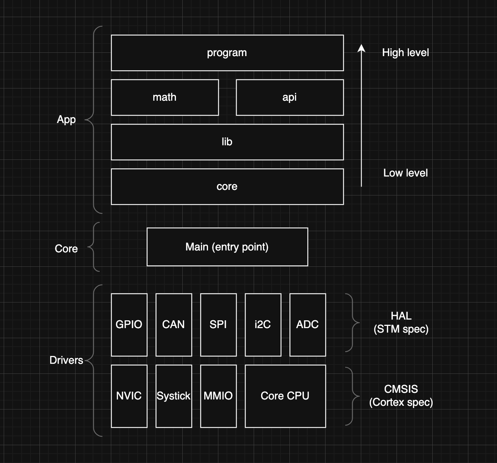

# Battery Management System Documentation

Here you will find more comprehensive documentation on the EV's battery management system (or BMS for short).

### What is this?

The BMS is a distributed system of sensors and controllers responsible for monitoring and protecting the EV's tractive battery. Such sensors include cell voltage monitors, pack current sensing, pack voltage sensing, temperature sensors (aka thermistors), and isolation monitoring hardware. The system aggregates this data to estimate battery state, enforce operating limits, and initiate protective actions when faults or unsafe conditions are detected.

The primary objective of the BMS is safety. The BMS is programmed and designed in such a way where loss of data, abnormal operating values or otherwise results in a disabling the high-current path and opening contactor. Certain safety measures includes:

- Reporting cell voltages, and if out of range, opening contactors
- Reporting pack temperatures, and if out of range, opening contactors
- Intentionally bleeding cells during charging to maintain a homogenous charge with regards to cell manufacturing defects

Secondary objectives include maintaining battery health and a two-way communication channel between the
microcontroller and a host computer to display voltage, temperature, current and other important metrics of the BMS.

### Rules

Mainly FSAE CDS 2026 Ruleset: `EV.7.3.*` and `EV.7.4.*`. Minor reference to `EV.7.5.*`.

## Software

A general overview of the software is written here. Implementation or feature specific details can be found in the `docs/software` subdirectory.

For example, details regarding charging and passive cell balancing can be found [here](software/charging.md).

Details regarding the safety provisions implemented into the controller can be found [here](software/safety.md).

Details regarding the communication protocol to the host computer interface can be found [here](software/interface.md).

Similarly, hardware-related details can be found in the `hardware` subdirectory.

### Philosophy

The software is structured around a strict separation between platform-dependent and platform-independent code. Hardware details are isolated as low as possible in the stack. Application logic is written assuming no direct knowledge of registers, peripherals, or MCU specifics.

Inline functions and macros are used deliberately. Macros are limited to compile-time configuration, constants, and low-level abstractions where function calls are not appropriate. Inline functions are preferred over macros where type safety and debuggability matter. The codebase favors explicit types and avoids implicit casting.

Portability is a core requirement. Moving to a different microcontroller or vendor HAL should require changes only in the lowest layers. Vendor HAL code is wrapped by thin (light, typically one line) driver interfaces. These drivers expose only what is needed and hide implementation details.

Each layer answers a different question. Lower layers define how something is done. Upper layers define what should happen. As code moves upward, it becomes more declarative and less concerned-imperative. SPI transactions become structured data. Hardware states become logical states.

An example of this is calling a high level superloop such as the cell balancing policy enforcer vs calling a low-level parsing function.

The intent is to make incorrect usage difficult and correct usage boring. In the image below, "spec" means specific to. For example, the CMSIS library is specific to all Cortex microcontrollers, while HAL is specific only to the STM32 microcontroller.

So, given the diagram below, one can assume that an STM32 microcontroller is a type of Cortex microcontroller that obeys the [Cortex **C**ommon **M**icrocontroller **S**oftware **I**nterface **S**tandard.](https://arm-software.github.io/CMSIS_6/latest/General/index.html)

