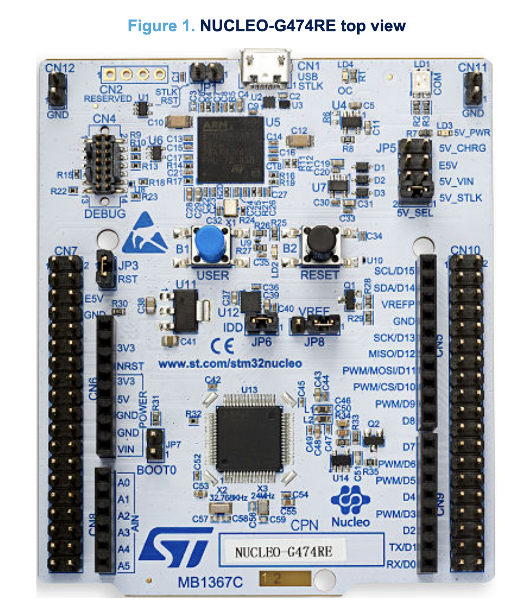

# Attaching the Saleae Logic Analyzer

On the ADBMS 6822 Eval board, there are 4 sets of header pins exposed to attach to a "motherboard" STM32G474 eval board.

With the microcontrollers STLINK USB connection oriented away from you, and the ADBMS 6822 isoSPI connectors oriented towards you, consider the pin group that is top left, top right, bottom left and bottom right.


The blue is top right, the purple is bottom right, the red is top left and the yellow is bottom left.

The SPI pins are located on the blue pin group. You will have to leave a gap between the STM32 G474 female header pins and the ADBMS6822 male pins as the Saleae nanoprobes will not attach properly to the top of the solder "mountain".

In order to measure the SPI waveforms coming to and from the microcontroller, use the following pins to measure the 4 lines.



The pins from top to bottom:

```
[1] SCL for I2C
[2] SDA for I2C
[3] VREFP
[4] GND
[5] SCK for SPI
[6] MISO for SPI
[7] MOSI for SPI
[8] CS for SPI
[9] PWM
[10] D8
```

So use pins 5,6,7,8 for SPI waveform measurements.
